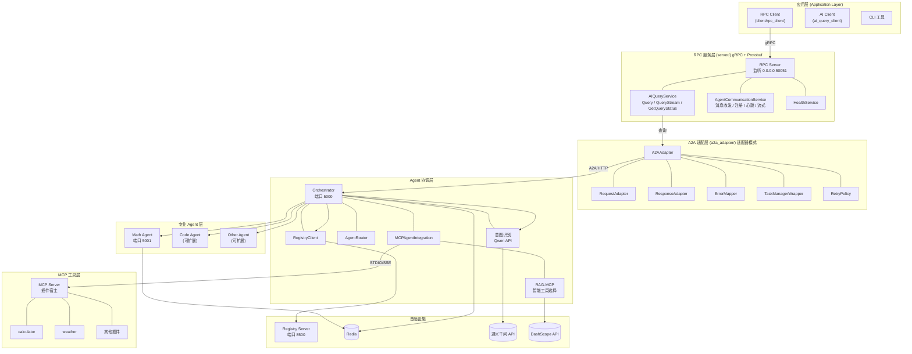

# Agent Communication RPC Framework — 学习笔记

> 基于对项目源码（`README.md`、`docs/`、各模块代码）的系统梳理。
> 配套文件：`docs/architecture.mmd`（Mermaid 架构图）、`docs/architecture.puml`（PlantUML 架构图）。

---

## 目录

- [1. 项目概览](#1-项目概览)
- [2. 技术栈](#2-技术栈)
- [3. 完整架构](#3-完整架构)
- [4. 目录结构逐层详解](#4-目录结构逐层详解)
- [5. 核心概念与协议](#5-核心概念与协议)
- [6. 关键数据流](#6-关键数据流)
- [7. 关键代码导读](#7-关键代码导读)
- [8. 设计模式与工程实践](#8-设计模式与工程实践)
- [9. 学习路线图](#9-学习路线图)
- [10. 编译与运行指南](#10-编译与运行指南)
- [11. 自测问题](#11-自测问题)

---

## 1. 项目概览

**Agent Communication RPC Framework** 是一个基于 **C++17 + gRPC** 的高性能 **AI Agent 通信框架**，专为多 Agent 协作场景设计。

一句话概括：**用户问题 → gRPC → RPC Server → A2A 适配器 → Orchestrator（AI 意图识别）→ 专业 Agent → MCP 工具 → 答案原路返回**。

### 核心能力

| 能力 | 说明 |
|------|------|
| gRPC 通信 | 基于 gRPC 的高性能远程过程调用，对外暴露统一接口 |
| A2A 协议 | Agent-to-Agent 通信协议（HTTP + JSON-RPC），多 Agent 协作 |
| MCP 集成 | Model Context Protocol 工具调用，让 Agent 具备调用外部工具的能力 |
| RAG-MCP | 基于向量检索的智能工具选择，只把最相关的 Top-K 个工具给 LLM |
| 服务发现 | Registry Server 负责 Agent 注册、发现、心跳保活 |
| 多 Agent 编排 | Orchestrator 识别意图并路由到合适的专业 Agent |

### 运行时全景

```
Registry(8500)  Orchestrator(5000)  Math Agent(5001)  RPC Server(50051)
     ▲                ▲                  ▲
     └── 注册/心跳 ────┴── 按 tag 查找 ────┘
```

---

## 2. 技术栈

| 类别 | 选型 |
|------|------|
| 语言 | C++17 |
| RPC 框架 | gRPC + Protocol Buffers |
| HTTP 客户端 | libcurl |
| JSON | nlohmann/json、jsoncpp |
| 测试 | Google Test + RapidCheck（属性测试） |
| 向量化 | 阿里云百炼 DashScope API |
| AI 模型 | 通义千问（Qwen） |
| 状态存储 | Redis（生产）/ 内存（开发） |
| 构建 | CMake 3.15+ |

---

## 3. 完整架构

### 3.1 分层架构总览



> 完整可渲染版本见 `docs/architecture.mmd`（Mermaid）与 `docs/architecture.puml`（PlantUML）。

### 3.2 分层职责

| 层次 | 目录 | 职责 |
|------|------|------|
| 应用层 | `client/`、`examples/` | 用户入口，发起请求 |
| 服务层 | `server/` | gRPC 服务端，暴露 RPC 接口 |
| 适配层 | `a2a_adapter/` | gRPC 协议 ↔ A2A 协议转换（解耦） |
| 协调层 | `orchestrator/`、`examples/ai_orchestrator/` | 意图识别、Agent 路由、任务分发 |
| Agent 层 | `examples/ai_orchestrator/` | 具体专业 Agent（Math/Code/...） |
| 工具层 | `mcp_server_integrated/` | MCP Server + 工具插件 |
| 公共层 | `common/`、`registry/`、`proto/` | 公共类型、注册中心、协议定义 |

---

## 4. 目录结构逐层详解

```
agent-communication/
├── proto/                      # Protobuf 接口定义（整个系统的"契约"）
│   ├── common.proto            #   通用类型: Status / ServiceInfo / HealthCheck
│   ├── ai_query.proto          #   AIQueryService: 同步/流式/状态查询
│   └── agent_service.proto     #   AgentCommunicationService: gRPC 四种模式示例
├── common/                     # 公共组件
│   ├── logger.h/cpp            #   日志系统（异步/彩色/级别）
│   ├── serializer.h/cpp        #   消息序列化（ProtobufBinary 等策略）
│   ├── load_balancer.h/cpp     #   负载均衡（轮询/随机等策略）
│   ├── circuit_breaker.h/cpp   #   熔断器
│   ├── metrics.h/cpp           #   指标收集
│   └── message_converter.h/cpp #   消息转换
├── registry/                   # 服务注册中心
│   └── service_registry.h/cpp  #   register / unregister / discover
├── server/                     # gRPC 服务端（对外入口）
│   ├── rpc_server.h/cpp        #   gRPC 服务器生命周期封装
│   ├── ai_query_service.h/cpp  #   AI 查询服务实现（内部走 A2A Adapter）
│   └── main.cpp                #   参数解析 / 环境变量 / 优雅关闭
├── client/                     # gRPC 客户端
│   ├── ai_query_client.h/cpp   #   AI 查询客户端
│   └── main.cpp                #   交互式命令行（/help /stream /status ...）
├── a2a/                        # A2A 协议核心实现
│   ├── core/                   #   JSON-RPC 请求/响应、HTTP 客户端、错误码
│   ├── models/                 #   AgentCard / AgentMessage / AgentTask / TaskStatus
│   ├── server/                 #   TaskManager + MemoryTaskStore
│   ├── client/                 #   A2AClient + CardResolver
│   └── examples/               #   RedisTaskStore / QwenClient / HttpServer /
│                               #   RegistryClient / AgentRegistry
├── a2a_adapter/                # A2A 适配层（适配器模式）
│   ├── a2a_adapter.h/cpp       #   主适配器
│   ├── request_adapter.*       #   gRPC 请求 → A2A 消息
│   ├── response_adapter.*      #   A2A 响应 → gRPC 响应
│   ├── error_mapper.*          #   A2A 错误码 → gRPC 状态码
│   ├── task_manager_wrapper.*  #   任务状态封装
│   ├── retry_policy.h          #   重试策略
│   └── a2a_metrics.*           #   指标
├── orchestrator/               # Agent 路由
│   └── agent_router.h/cpp      #   SKILL_MATCH / ROUND_ROBIN / RANDOM / LEAST_LOAD
├── mcp/                        # MCP 模块 + RAG-MCP
│   ├── mcp_client.h/cpp        #   MCP 客户端（STDIO / SSE 传输）
│   ├── mcp_tool_manager.*      #   工具管理器
│   ├── mcp_agent_integration.* #   Agent 集成层（工具发现/调用/降级）
│   └── rag/                    #   RAG-MCP 智能工具选择
│       ├── embedding_service.* #     DashScope 文本向量化
│       ├── embedding_cache.*   #     LRU 缓存
│       ├── vector_index.*      #     余弦相似度向量索引
│       ├── tool_retriever.*    #     工具检索（整合以上三者）
│       └── tool_validator.*    #     工具验证
├── mcp_server_integrated/      # MCP Server（独立可编译）
│   ├── src/server/             #   MCP 协议服务器
│   ├── src/transport/          #   STDIO / SSE / HTTP-Stream 传输
│   ├── src/loader/             #   插件动态加载器
│   ├── src/interface/          #   PluginAPI 接口定义
│   └── plugins/                #   工具插件（calculator/weather/sleep/...）
├── examples/                   # 示例程序
│   ├── ai_orchestrator/        #   ★ 多 Agent 系统完整演示
│   │   ├── registry_server_main.cpp   # 注册中心 (8500)
│   │   ├── orchestrator_main.cpp      # 协调器 (5000)
│   │   ├── math_agent_main.cpp        # Math Agent (5001)
│   │   ├── client_main.cpp            # 交互客户端
│   │   ├── start_system.sh            # 一键启动
│   │   └── stop_system.sh             # 一键停止
│   ├── rag_mcp_example.cpp     #   RAG-MCP 智能工具选择演示
│   ├── grpc_ai_demo/           #   gRPC 简易演示
│   └── ...                     #   其他示例
├── tests/                      # Google Test + RapidCheck
│   ├── test_proto_roundtrip.cpp      # Protobuf 序列化往返
│   ├── test_a2a_integration.cpp      # A2A 集成
│   ├── test_task_manager_properties.cpp  # 任务管理器属性测试
│   ├── test_rag_mcp_properties.cpp   # RAG-MCP 属性测试
│   └── ...                     # 每个模块都有对应测试
└── docs/                       # 文档
    ├── architecture.md         #   架构设计
    ├── a2a-protocol.md         #   A2A 协议详解
    ├── rag-mcp-guide.md        #   RAG-MCP 指南
    ├── mcp-plugin-development.md  # MCP 插件开发
    ├── deployment.md           #   部署指南
    ├── architecture.mmd        #   ★ 本笔记配套: Mermaid 架构图
    ├── architecture.puml       #   ★ 本笔记配套: PlantUML 架构图
    └── learning-notes.md       #   ★ 本笔记
```

---

## 5. 核心概念与协议

### 5.1 gRPC 的四种 RPC 模式（见 `proto/agent_service.proto`）

| 模式 | 示例 RPC | 说明 |
|------|----------|------|
| 简单 RPC（Unary） | `SendMessage` / `RegisterAgent` / `Heartbeat` | 请求-响应，最常用 |
| 服务端流式 | `ListenMessages` | 客户端发一次请求，服务端持续推送 |
| 客户端流式 | `BatchSendMessages` | 客户端持续发送，服务端一次返回 |
| 双向流式 | `RealTimeCommunication` | 双方同时持续收发 |

> 💡 **学习提示**：想理解 gRPC，这份 proto 是最直观的教材 —— 一个文件覆盖全部四种模式。

### 5.2 A2A 协议（Agent-to-Agent）

- 传输：**HTTP + JSON-RPC 2.0**
- 核心方法：`message/send`（发消息）、`message/stream`（流式）、`task/get`、`task/cancel`
- 核心模型：
  - **AgentCard**：Agent 的"名片"，描述名称/能力/技能/URL，暴露在 `/.well-known/agent-card.json`（A2A 标准端点）
  - **AgentMessage**：消息，含 `role`（user/agent）+ `parts`（text/image/file...）
  - **AgentTask**：一次完整交互，含 id/context_id/status/messages/artifacts
- 任务状态机：

```
SUBMITTED ──► RUNNING ──► COMPLETED
                  │  ├──► FAILED
                  │  └──► CANCELED
```

| 当前状态 | 允许转换到 |
|----------|------------|
| SUBMITTED | RUNNING, CANCELED |
| RUNNING | COMPLETED, FAILED, CANCELED |
| COMPLETED / FAILED / CANCELED | 终态 |

### 5.3 MCP（Model Context Protocol）

- 角色：**MCP Server**（工具提供方，本项目的 `mcp_server_integrated/`）+ **MCP Client**（工具调用方，本项目的 `mcp/mcp_client.h`）
- 两种传输方式：
  - **STDIO**（默认）：MCP Server 作为子进程，通过管道通信 —— 本地部署
  - **SSE**：通过 HTTP/SSE 连接远程 MCP Server —— 分布式部署
- 插件机制：每个插件实现 `PluginAPI` C 接口（`CreatePlugin()`），编译为动态库，运行时由 `PluginsLoader` 动态加载

### 5.4 RAG-MCP（智能工具选择，本项目亮点）

**问题**：MCP Server 有 12+ 个工具时，全部塞给 LLM 会浪费 Token、降低准确率。

**方案**：工具描述向量化存索引 → 查询时只返回最相关的 Top-K 个。

```
用户查询 "计算 123 + 456"
        │
        ▼
EmbeddingService ←─ DashScope API 把查询向量化
        │
        ▼
VectorIndex      ←─ 余弦相似度搜索（工具向量库）
        │ Top-K 相关工具
        ▼
返回 3-5 个相关工具（而非全部 12 个）
```

| 组件 | 职责 |
|------|------|
| `EmbeddingService` | 调用 DashScope API 文本向量化 |
| `EmbeddingCache` | LRU 缓存，减少 API 调用（默认 1000 条） |
| `VectorIndex` | 余弦相似度向量搜索 |
| `ToolRetriever` | 整合以上三者，`indexTools()` 建索引 → `retrieve(query)` 返回 Top-K |
| `ToolValidator` | 验证工具兼容性/可用性 |

关键参数：`top_k`（默认 5）、`similarity_threshold`（默认 0.3）。**RAG 不可用时自动降级为返回全部工具**（容错设计）。

---

## 6. 关键数据流

### 6.1 同步查询（以 "1+7" 为例）

```
1. rpc_client 发送 AIQueryRequest{question: "1+7"}
2. rpc_server 的 AIQueryService.Query() 处理
3. A2AAdapter.processQuery() 转换请求
4. A2AClient.send_message() → HTTP POST → Orchestrator (5000)
5. Orchestrator 用 Qwen 识别意图 → "math"
6. RegistryClient 按 tag="math" 找到 Math Agent (5001)
7. Orchestrator 转发 message/send 给 Math Agent
8. Math Agent 用 RAG 检索工具 → 调用 MCP calculator → "1+7 = 8"
9. 响应原路返回: Math Agent → Orchestrator → A2A → RPC Server → Client
```

### 6.2 流式查询

```
1. Client 调用 QueryStream (gRPC server-streaming)
2. AIQueryService 走 A2AAdapter.processQueryStreaming()
3. 对 Orchestrator 发起 message/stream (SSE)
4. 逐块接收: stream_start → intent → chunk...chunk → stream_end
5. 每个事件包装成 AIStreamEvent 通过 gRPC stream 推给 Client
```

> 💡 **细节**：Orchestrator 流式输出时做了 **UTF-8 安全分块**（`orchestrator_main.cpp` 的 `utf8_safe_chunk`），避免在中文多字节字符中间切断 —— 值得学习的细节。

### 6.3 Agent 注册与心跳

```
Agent ──register──► Registry
Agent ──heartbeat──► Registry  (每 30 秒)
Registry ──超时未收到心跳──► 标记 Agent 不健康
Orchestrator ──select_agent_by_tag("math")──► Registry ──► Math Agent 地址
```

---

## 7. 关键代码导读

按推荐阅读顺序：

| 文件 | 学什么 |
|------|--------|
| `proto/ai_query.proto` | Protobuf 消息设计：如何用字段编号、map、repeated、enum 组织请求/响应 |
| `proto/agent_service.proto` | gRPC 四种 RPC 模式声明 |
| `common/src/serializer.cpp` | 序列化策略封装（可切换 ProtobufBinary 等） |
| `common/src/circuit_breaker.cpp` | 熔断器实现（状态机：关闭→打开→半开） |
| `a2a/models/agent_task.cpp` | A2A 数据模型 + 链式 builder 风格（`AgentTask::create().with_id(...)`） |
| `a2a/src/server/task_manager.cpp` | 任务生命周期管理 |
| `a2a_adapter/src/a2a_adapter.cpp` | 适配器模式实战：如何把 gRPC 请求翻译成 A2A 协议 |
| `server/src/main.cpp` | gRPC 服务端完整生命周期：参数 → 日志 → 初始化 → 信号处理 → 优雅关闭 |
| `examples/ai_orchestrator/orchestrator_main.cpp` | 协调器全貌：意图识别 + Agent 路由 + MCP 工具 + 流式输出 |
| `examples/ai_orchestrator/math_agent_main.cpp` | 专业 Agent 全貌：RAG 检索 → MCP 调用 → Qwen 组织答案 |
| `mcp/src/rag/tool_retriever.cpp` | RAG 检索核心流程 |
| `mcp_server_integrated/plugins/calculator/Calculator.cpp` | 插件开发范式 + 手写递归下降表达式解析器 |
| `tests/test_task_manager_properties.cpp` | RapidCheck 属性测试写法 |

### 7.1 代码片段速览

**意图识别（Orchestrator）** —— 用 LLM 做路由决策：

```cpp
std::string analyze_intent(const std::string& text) {
    std::string prompt = "判断以下用户输入属于哪个类别，只回答类别名称：\n"
                        "- math: 数学计算、方程求解\n"
                        "- code: 编程、代码相关\n"
                        "- general: 其他对话\n\n"
                        "用户输入: " + text;
    std::string result = qwen_client_.chat("", prompt);
    if (result.find("math") != std::string::npos) return "math";
    if (result.find("code") != std::string::npos) return "code";
    return "general";
}
```

**RAG 工具检索（Math Agent）** —— 优先检索相关工具，兜底 calculator：

```cpp
if (mcp_integration_->isRAGEnabled()) {
    relevant_tools = mcp_integration_->getRelevantTools(question, 5);  // Top-K
} else if (mcp_integration_->hasToolAvailable("calculator")) {
    // 降级：直接检查 calculator
}
// 优先调用 calculator；失败则回退再次尝试
```

**MCP 插件接口（Calculator）** —— 动态库导出 C 接口：

```cpp
extern "C" PLUGIN_API PluginAPI* CreatePlugin() { return &plugin; }
extern "C" PLUGIN_API void DestroyPlugin(PluginAPI*) {}
```

---

## 8. 设计模式与工程实践

| 模式/实践 | 体现在哪里 | 收益 |
|-----------|------------|------|
| **分层架构** | 服务层→适配层→协调层→Agent 层→工具层，每层只依赖下层 | 低耦合、易替换 |
| **适配器模式** | `a2a_adapter/` 把 gRPC 协议翻译成 A2A 协议 | 新增协议只需新写适配器 |
| **策略模式** | `LoadBalancer` 支持轮询/随机/最少负载；`AgentRouter` 支持技能匹配 | 运行时/配置可切换策略 |
| **降级机制** | MCP 不可用→无工具模式；RAG 不可用→全量工具；Agent 不可达→通用模型兜底 | 系统健壮性 |
| **状态机** | Task 状态转换有严格规则表 | 状态可预测、可测试 |
| **错误映射** | `ErrorMapper` 统一 A2A↔gRPC 错误码 | 跨协议错误语义一致 |
| **缓存** | `EmbeddingCache` LRU 减少 API 调用 | 降本提速 |
| **可观测性** | 统一日志、指标（`a2a_metrics`）、健康检查 | 便于运维 |
| **优雅关闭** | `server/main.cpp` 信号处理 + 主循环退出 | 生产级服务 |
| **属性测试** | RapidCheck 随机输入验证不变量 | 发现边界 bug |

**值得复用的设计理念**：
1. 对外暴露"简化门面"（`MCPAgentIntegration`），内部组合复杂组件
2. 失败不抛异常而是**降级返回**，保持调用链可用
3. 跨协议边界处做**双向适配**，而不是互相污染

---

## 9. 学习路线图

| 阶段 | 主题 | 重点文件 | 学完能回答 |
|------|------|----------|-----------|
| 1 | Protobuf 与 gRPC | `proto/*.proto` | gRPC 四种模式怎么声明？ |
| 2 | 公共组件 | `common/src/serializer.cpp`、`circuit_breaker.cpp` | 熔断器状态机怎么转？ |
| 3 | A2A 协议 | `a2a/models/` + `docs/a2a-protocol.md` | 任务状态机有哪些状态？ |
| 4 | 适配层 | `a2a_adapter/` 全套 | gRPC 请求怎么变成 A2A 消息？ |
| 5 | 服务端 | `server/src/main.cpp` | 服务端如何优雅关闭？ |
| 6 | 多 Agent 系统 | `examples/ai_orchestrator/` 三个 main | 意图怎么路由到 Agent？ |
| 7 | MCP | `mcp/` + `mcp_server_integrated/` | STDIO 和 SSE 传输的区别？ |
| 8 | RAG-MCP | `mcp/rag/` 全套 | Top-K 是怎么检索出来的？ |
| 9 | 测试 | `tests/test_rag_mcp_properties.cpp` | 属性测试和不变量是什么？ |
| 10 | 扩展实践 | 自行添加一个新插件 / 新 Agent | 能不能跑通端到端？ |

**建议动手练习**：
1. 写一个自己的 MCP 插件（参考 `plugins/calculator`），比如 `reverse`（字符串反转），编译并放到插件目录
2. 仿照 Math Agent 写一个 `code_agent_main.cpp`（识别到 code 意图时路由过去）
3. 给 `AgentRouter` 增加一个新的路由策略（如按 Agent 负载加权）
4. 用 RapidCheck 给 `VectorIndex` 写属性测试（如：检索结果相关性分数单调递减）

---

## 10. 编译与运行指南

### 10.1 环境要求（官方面向 Linux）

Ubuntu 20.04+，需要：CMake 3.15+、GCC 9+、gRPC 1.51、protobuf、libcurl、jsoncpp、nlohmann-json、gtest、hiredis、redis-server。

### 10.2 编译

```bash
# 1. 主项目
mkdir -p build && cd build
cmake .. && make -j$(nproc)
cd ..

# 2. MCP Server（可选，工具调用需要）
cd mcp_server_integrated && mkdir -p build && cd build
cmake .. && make -j$(nproc)
cd ../..
```

### 10.3 运行（完整功能）

```bash
# 环境变量（学习基础流程只需要 QWEN_API_KEY）
export QWEN_API_KEY=sk-xxx
export DASHSCOPE_API_KEY=sk-xxx        # RAG 用，可选

# Redis（任务状态存储）
redis-server &

# 一键启动多 Agent 系统（Registry 8500 + Math Agent 5001 + Orchestrator 5000）
ENABLE_MCP=true ENABLE_RAG=true ./examples/ai_orchestrator/start_system.sh

# RPC Server（新终端）
./build/server/rpc_server

# RPC Client（新终端），输入 "1+7" 试试
./build/client/rpc_client
```

### 10.4 客户端命令

| 命令 | 说明 |
|------|------|
| `/help` | 帮助 |
| `/stream` | 切换流式模式 |
| `/context <id>` | 切换对话上下文 |
| `/status` | 连接状态 |
| `/quit` | 退出 |

> ⚠️ 本机是 macOS，gRPC/protobuf 依赖可能需要通过 Homebrew 安装；官方保证的环境是 Ubuntu 20.04+。

---

## 11. 自测问题

读完本笔记后，试着回答（答案见上文的对应小节）：

1. 一次 `1+7` 的查询，请求经过了哪些进程？各进程用什么协议通信？（→ §6.1）
2. gRPC 有哪四种 RPC 模式？分别在 `agent_service.proto` 里对应哪个 RPC？（→ §5.1）
3. A2A 协议的任务状态机有哪些状态？哪些是终态？（→ §5.2）
4. A2A Adapter 里的 `RequestAdapter` 和 `ResponseAdapter` 各做什么？（→ §4 目录详解）
5. RAG-MCP 为什么能省 Token？它检索工具的具体流程是什么？（→ §5.4）
6. 如果 MCP Server 挂掉了，系统会崩溃吗？为什么？（→ §8 降级机制）
7. `/.well-known/agent-card.json` 是干什么的？A2A 协议标准为什么需要它？（→ §5.2）
8. 想新增一个"天气 Agent"，需要改哪些文件？（→ §9 动手练习 / docs/architecture.md 扩展点）
9. 流式输出时为什么做 UTF-8 安全分块？（→ §6.2）
10. 属性测试和普通单元测试有什么区别？（→ §8）

---

*本笔记基于项目源码梳理，配套架构图见 `docs/architecture.mmd` 与 `docs/architecture.puml`。*
